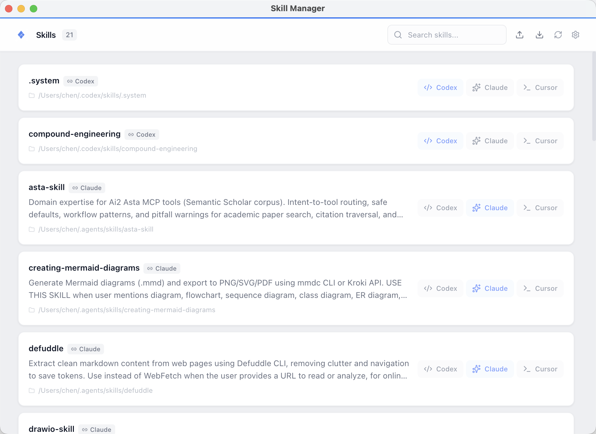

# Skill Manager · 技能管理器

> **Your unified control center for AI coding tool skills.**
> **Instantly discover, link, and manage skills across Codex, Claude Code, Cursor, and any custom tool — all in one place.**
>
> **AI 编程工具技能的集中管控中心。**
> **一键发现、链接、管理 Codex、Claude Code、Cursor 以及任意自定义工具的技能——全部集中在一个界面。**

[](LICENSE)
[](https://www.electronjs.org/)
[](https://react.dev/)
[](https://www.typescriptlang.org/)

---

## 📖 Overview · 概览

### The Problem · 痛点

AI coding assistants — Codex, Claude Code, Cursor, and many others — each maintain their **own isolated skill directories** scattered across your filesystem:

| Tool · 工具 | Default path · 默认路径 |
|---|---|
| Codex | `~/.codex/skills/` |
| Claude Code | `~/.agents/skills/` |
| Cursor | `~/.cursor/skills/` |
| ... and any custom tools you use | ... |

Skills installed in one tool's folder are **invisible to all others**. Moving or copying them manually is tedious, error-prone, and quickly becomes unmanageable as your skill collection grows.

每个 AI 编程助手都有自己的技能目录，技能安装在某个工具后，**其他工具完全看不到**。手动复制或移动不仅繁琐，而且随着技能增多几乎无法管理。

### The Solution · 解决方案

**Skill Manager** introduces **symlink-based sharing**: a single skill stays in its original location, and you create lightweight symlinks to it from any tool's directory — all with **a single click** in a clean desktop interface.

**Skill Manager** 通过 **基于软链接的共享机制** 解决问题：每个技能保留在原位，只需在桌面界面中**一键点击**，即可从任意工具目录创建指向它的轻量级软链接。

```
┌─────────────────────────────────────────────────────────────┐
│                    Skill Manager App                        │
│  ┌─────────────────────┐  ┌─────────────────────────────┐  │
│  │    Scanner           │  │    Symlink Manager          │  │
│  │    (discovers skills) │  │    (link / unlink)          │  │
│  └──────────┬──────────┘  └──────────────┬──────────────┘  │
│             │                             │                  │
└─────────────┼─────────────────────────────┼──────────────────┘
              │                             │
              ▼                             ▼
    ┌─────────────────────────────────────────────┐
    │            Filesystem (real skills)          │
    │                                             │
    │  ~/.codex/skills/     ~/.agents/skills/     │
    │    ├─ my-skill/          ├─ my-skill ───────│── symlink
    │    ├─ other-skill/       ├─ other-skill ─── │── symlink
    │    └─ ...                └─ ...             │
    └─────────────────────────────────────────────┘
```

---

## 🚀 Core Features · 核心功能

| Feature · 功能 | Description · 说明 |
|---|---|
| 🧩 **Unified discovery** · 统一发现 | Scans ALL known skill paths at once — Codex, Claude, Cursor, plus any custom paths you register in Settings. No more hunting through hidden folders. <br> 一次性扫描所有已知技能路径，无需逐个翻找。 |
| 🔗 **One-click symlink** · 一键软链接 | Every skill shows toggle buttons for every registered tool. Click to link (creates symlink), click again to unlink (removes it). The original skill file is never touched. <br> 每个技能显示所有工具的开关按钮，点击即创建软链接，再点击即删除，原始文件不受影响。 |
| 🏠 **Smart home detection** · 智能归属 | Skills physically located in a tool's directory are automatically detected. The home tool toggle is always ON and locked — preventing accidental removal. <br> 技能自动识别归属工具，归属按钮始终开启且锁定，杜绝误操作。 |
| ⚙️ **Extensible — custom tools** · 可扩展 | Register any tool's skill directory in Settings. Each custom tool automatically gets its own toggle column on every skill card, with symlinks created the same way as built-in tools. <br> 在设置中注册任意工具，自动生成专属开关列，软链接机制完全一致。 |
| 💾 **Snapshot export/import** · 快照 | Save your complete link configuration as a JSON file. Share it with teammates or restore it later — one click to apply. <br> 将完整链接配置导出为 JSON 文件，分享给团队或日后恢复。 |

---

## 📸 Screenshot · 界面预览
## 📸 Screenshot · 界面预览



## 🎬 Demo Video · 功能演示

Check out the quick demo to see Skill Manager in action — scanning skills, one-click symlink toggling, and custom tool registration.

观看快速演示视频，了解 Skill Manager 的实际操作：扫描技能、一键创建软链接、自定义工具注册。

<video src="docs/demo.mp4" width="800" controls></video>

> ⚡ The demo file is **`docs/demo.mp4`** (recommended < 10 MB, H.264, 1280×800, 15fps).
>
> 演示文件请保存为 **`docs/demo.mp4`**（建议 < 10 MB，H.264，1280×800，15fps）。

---

## 🧠 What problem does it solve? · 解决了什么问题?

AI coding assistants — Codex, Claude Code, Cursor, and many more — each maintain their own skill directories scattered across the filesystem:

- `~/.codex/skills/`
- `~/.agents/skills/`
- `~/.cc-switch/skills/`
- Various other custom paths

Skills installed in one tool's directory are invisible to another. Moving or copying them manually is error-prone and tedious.

**Skill Manager** solves this by introducing **symlink-based sharing**: a single skill stays in one place, and you create lightweight symlinks to it from any tool's directory. The result is a **unified, searchable, one-click interface** for managing which tools can see which skills.

---

AI 编程助手（Codex、Claude Code、Cursor 等）各自维护独立的技能目录，散落在系统各处：

- `~/.codex/skills/`
- `~/.agents/skills/`
- `~/.cc-switch/skills/`
- 各种自定义路径

安装在某个工具目录下的技能，对其他工具不可见。手动复制或移动不仅繁琐，而且容易出错。

**Skill Manager** 通过 **基于软链接的共享机制** 解决了这个问题：一个技能保存在一个位置，从任意工具目录创建指向它的轻量级软链接。最终呈现的是一个 **统一、可搜索、一键操作** 的技能管控界面。

---

## 🏗️ How it works · 工作原理

```
┌─────────────────────────────────────────────────────────────┐
│                    Skill Manager App                        │
│  ┌─────────────────────┐  ┌─────────────────────────────┐  │
│  │    Scanner           │  │    Symlink Manager          │  │
│  │    (discovers skills) │  │    (link/unlink)            │  │
│  └──────────┬──────────┘  └──────────────┬──────────────┘  │
│             │                             │                  │
└─────────────┼─────────────────────────────┼──────────────────┘
              │                             │
              ▼                             ▼
    ┌─────────────────────────────────────────────┐
    │            Filesystem (real skills)          │
    │                                             │
    │  ~/.codex/skills/  ~/.agents/skills/  ...   │
    │     ├─ my-skill/        ├─ my-skill ────────│── symlink
    │     ├─ other-skill/     ├─ other-skill ──── │── symlink
    │     └─ ...              └─ ...              │
    └─────────────────────────────────────────────┘
```

### Data flow · 数据流

1. **Scan** → `ScannerOrchestrator` examines all known skill directories, parses SKILL.md frontmatter, and deduplicates skills by name.
2. **Detect** → For each skill, the system checks which tools already have symlinks pointing to it (`linkedTools`) and which tool it physically belongs to (`homeTool`).
3. **Display** → The React frontend renders a card for each skill, with toggle buttons for every registered tool.
4. **Toggle** → Clicking a button calls the IPC handler, which creates or removes a symlink at `<tool-dir>/<skill-name>` → `<skill-source-path>`.
5. **Refresh** → After any change, the app rescans to update the UI.

---

## ✨ Features Deep Dive · 功能详解

### 🧩 Unified Discovery · 统一发现

Scans **all** known skill paths simultaneously:
- Codex → `~/.codex/skills/`
- Claude → `~/.agents/skills/`
- Cursor → `~/.cursor/skills/` + `~/Library/Application Support/Cursor/User/skills/`
- **Custom tools** → Any path you register in Settings

Skills with the same directory name across multiple locations are automatically deduplicated. The system keeps the first discovered location and enriches it with metadata from other copies.

### 🔗 Symlink Toggling · 软链接开关

| Interaction · 操作 | Result · 结果 |
|---|---|
| Click OFF button | Creates a symlink: `~/.codex/skills/<skill>/` → `<actual-path>/` |
| Click ON button · 点击开启按钮 | Removes the symlink. Original files untouched. 删除软链接，原始文件不受影响 |
| Home tool toggle | Always ON and locked. Cannot be removed. 始终开启且锁定，不可删除 |

**Symlinks are lightweight** — they take virtually no disk space and work transparently. The tool reads the skill as if it were physically in its directory.

**软链接非常轻量** — 几乎不占用磁盘空间，且对工具透明——工具读取时就像技能物理存在于其目录中一样。

### ⚙️ Custom Tool Registration · 自定义工具注册

1. Open Settings (gear icon in the header)
2. In the "Custom tools" section, enter a name and path
3. Click **Add**, then **Save**
4. After the next scan, each skill card shows a toggle for your custom tool
5. Works exactly like built-in tools — one-click symlink creation

Example: Registering `qodercli` with path `/path/to/qodercli/skills` makes every skill show a `Qodercli` button.

### 💾 Snapshot Export/Import · 快照导出/导入

**Export** saves the current link configuration (which skills are linked to which tools) as a portable JSON file. **Import** reads a snapshot and applies the configuration — useful for:
- Sharing your curated skill set with teammates
- Backing up your configuration before experimenting
- Deploying the same setup across multiple machines

---

## 📦 Installation · 安装

### Prerequisites · 前置要求

- [Node.js](https://nodejs.org/) >= 18
- [pnpm](https://pnpm.io/) (recommended) or npm

### Setup · 配置

```bash
# Clone the repository · 克隆仓库
git clone https://github.com/Wangchena/skill-manager.git
cd skill-manager

# Install dependencies · 安装依赖
pnpm install

# Start development server · 启动开发服务器
pnpm run dev
```

### Build for production · 构建发布版本

```bash
pnpm run build
```

The distributable package will be in the `dist/` directory.

---

## 🛠️ Development · 开发

```bash
# Start dev server with hot reload · 启动热重载开发服务器
pnpm run dev

# Type checking · 类型检查
pnpm run typecheck

# Run tests · 运行测试
pnpm run test

# Lint · 代码检查
pnpm run lint
```

---

## 🧱 Tech Stack · 技术栈

| Layer · 层 | Technology · 技术 |
|---|---|
| Desktop framework | Electron 33 |
| UI framework | React 19 |
| Language | TypeScript 5.7 |
| Build | electron-vite + Vite 5 |
| Styling | Tailwind CSS v4 |
| State management | Zustand v5 |
| Icons | Lucide React |
| Scanner | Custom TypeScript module |

---

## 📁 Project Structure · 项目结构

```
skill-manager/
├── packages/
│   └── scanner/              # Core scanner library
│       ├── src/
│       │   ├── scanner.ts    # Abstract scanner interface
│       │   ├── codex-scanner.ts
│       │   ├── claude-scanner.ts
│       │   ├── cursor-scanner.ts
│       │   └── types.ts      # SkillRecord type
│       └── __tests__/
├── src/
│   ├── main/                 # Electron main process
│   │   ├── index.ts          # App entry point
│   │   ├── ipc-handlers.ts   # IPC bridge
│   │   ├── scanner-orchestrator.ts  # Unified scanner + symlink manager
│   │   ├── settings-store.ts # Settings persistence
│   │   ├── snapshot-manager.ts
│   │   └── skill-exporter.ts
│   ├── preload/              # Preload script (context bridge)
│   │   └── index.ts
│   └── renderer/             # React frontend
│       └── src/
│           ├── App.tsx
│           ├── components/
│           │   ├── AppIcon.tsx      # Custom SVG icon
│           │   ├── SkillCard.tsx    # Per-tool toggle card
│           │   ├── SettingsPanel.tsx
│           │   ├── ExportDialog.tsx
│           │   ├── ImportDialog.tsx
│           │   └── ...
│           ├── store/
│           │   ├── skill-store.ts   # Zustand store
│           │   └── settings-store.ts
│           └── styles/
│               └── globals.css
├── LICENSE
└── package.json
```

---

## 🤝 Contributing · 贡献

Contributions, issues, and feature requests are welcome! Feel free to check the [issues page](https://github.com/Wangchena/skill-manager/issues).

欢迎提交 Issue、功能请求或 Pull Request！

---

## 📄 License · 许可证

MIT © 2026 Skill Manager. See [LICENSE](LICENSE) for details.
