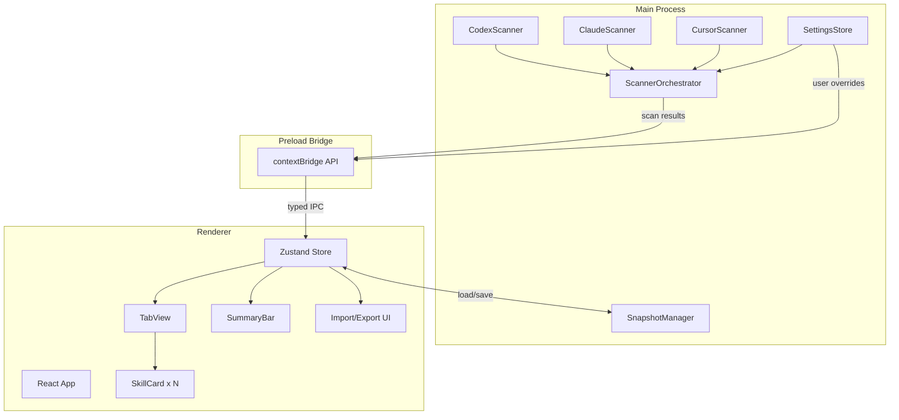

# Plan: Skill Management Client

## Summary

Build an open-source Electron desktop client (electron-vite + React + TypeScript + Tailwind CSS) that scans local skill directories of Codex, Claude Code, and Cursor, presents them in a tool-tabbed UI with visual enable/disable assembly, and supports importing and exporting configuration snapshots. The scanner interface is published as a standalone npm package so the community can add support for additional AI tools.

## Problem Frame

There is no unified way to discover, compare, and manage skills across AI coding tools. Users install skills via different mechanisms (Claude Code plugins, Codex skills, Cursor extensions) with no visibility into what's installed, which combination is active, or how to share a curated set with teammates. Each tool stores its skills in a different directory with different metadata formats. The result is friction in curation, duplication, and team-wide distribution.

---

## Requirements

(Origin: `docs/brainstorms/2026-06-15-skill-management-client-requirements.md`)

### Scanning and Discovery

- R1. Scan `~/.codex/skills/` recursively and extract skill metadata (name, description, source path) from manifests.
- R2. Scan `~/.agents/skills/` recursively with the same extraction rules.
- R3. Scan Cursor's skill directory with the same extraction rules.
- R4. Define a public Scanner interface returning typed SkillRecords. External contributions implement this interface without touching the UI.
- R5. Auto-scan on startup with a manual Refresh button.

### User Interface

- R6. One tab per detected tool. Tools with zero installed skills show an empty state.
- R7. Skill cards display: name, short description, source file path, tool origin badge. Long descriptions truncate with expand.
- R8. Enable/disable toggle on each card with a live enabled-count update.
- R9. A persistent summary bar showing total / enabled skill counts.

### Configuration Snapshots

- R10. Export the enabled skill set to a versioned JSON file at a user-chosen path.
- R11. Import a snapshot and apply its enabled set. Skills referenced but not installed locally are shown as unavailable.
- R12. Snapshots include `created_at`, a version field, counts, and an optional user label.
- R13. Export a single skill's source as a .zip archive.

### Cross-Platform

- R14. Each scanner resolves default paths per OS (macOS, Windows, Linux) with user override in settings.

---

## Key Technical Decisions

- **KTD1. electron-vite as build tool.** electron-vite provides a Vite-native workflow with fast HMR and a clean main/preload/renderer process split. Minimal configuration overhead vs. manual webpack setups.
- **KTD2. Scanner interface as a published npm package.** The `Scanner` abstract class (name, description, defaultPaths, scan()) and `SkillRecord` type live in a standalone `@skill-manager/scanner` package. Community contributors write scanners against this package without cloning the UI repo. The package is versioned independently so scanner authors lock to a stable API.
- **KTD3. Built-in scanners ship with the app.** v1 ships `CodexScanner`, `ClaudeScanner`, and `CursorScanner` as built-in modules. Runtime plugin loading (watching a `scanners/` directory) introduces security review, bundling complexity, and cross-platform path resolution that doesn't justify itself until a third-party scanner exists. When a third-party scanner is written, it can be added as a PR to the built-in set; the npm package already defines the contract.
- **KTD4. Tailwind CSS for UI styling.** Lightweight, tree-shakeable, no heavy component library dependency. Developer familiarity is high across the React ecosystem. Enables quick iteration on component styling without fighting a design system.
- **KTD5. Zustand for state management.** Minimal boilerplate, TypeScript-native, works outside React components (useful for scanner orchestration in the main process bridge). Keeps the app lightweight.
- **KTD6. Snapshot format as JSON Schema.** Portable, easy to diff in git, human-readable. Version field allows forward-compatible schema evolution.

---

## High-Level Technical Design

The app follows Electron's three-process model: main process (system access, file I/O), preload (context bridge), and renderer (React UI).

### Data flow

1. **Startup:** Renderer sends `scan` request via preload bridge → main process runs ScannerOrchestrator → each Scanner reads its configured directory → results return as typed `SkillRecord[]`.
2. **Assembly:** User toggles a card in React → Zustand store updates enabled set → SummaryBar re-renders live. No IPC needed for assembly state (purely client-side).
3. **Snapshot:** "Export" serialises the Zustand store's enabled set through the bridge → main process writes JSON to user-chosen path. "Import" reads a file through the bridge → validates schema → merges into store, marking missing skills.

---

## Implementation Units

### U1. Project scaffold and build tooling

- **Goal:** Initialize the Electron project with electron-vite, React, TypeScript and Tailwind CSS. Set up the three-process directory layout, linting, and a working "Hello World" window.
- **Requirements:** (no behavioral requirements — pure scaffold)
- **Dependencies:** None
- **Files:**
  - `package.json`
  - `electron.vite.config.ts`
  - `tsconfig.json`, `tsconfig.node.json`, `tsconfig.web.json`
  - `src/main/index.ts`
  - `src/preload/index.ts`
  - `src/renderer/src/App.tsx`
  - `src/renderer/src/main.tsx`
  - `src/renderer/index.html`
  - `tailwind.config.js`, `postcss.config.js`
  - `.eslintrc.cjs`, `.gitignore`
- **Approach:** Use `create-electron-vite` with the React/TypeScript template, then add Tailwind via PostCSS. Wire up the main process entry, preload script, and renderer entry. Verify the app launches and displays a React page. Publish `@skill-manager/scanner` as the first npm package (see U2).
- **Test expectation:** none — scaffold verification is manual: app launches, HMR works, Tailwind classes render.

---

### U2. Scanner core library and built-in implementations

- **Goal:** Define the `Scanner` abstract class and `SkillRecord` type in the `@skill-manager/scanner` package. Implement `CodexScanner`, `ClaudeScanner`, and `CursorScanner`. Build `ScannerOrchestrator` in the main process that runs all registered scanners and merges results.
- **Requirements:** R1, R2, R3, R4, R14
- **Dependencies:** U1
- **Files:**
  - `packages/scanner/src/scanner.ts` — abstract class
  - `packages/scanner/src/types.ts` — SkillRecord, ScanResult interfaces
  - `packages/scanner/src/codex-scanner.ts`
  - `packages/scanner/src/claude-scanner.ts`
  - `packages/scanner/src/cursor-scanner.ts`
  - `packages/scanner/src/index.ts` — public exports
  - `packages/scanner/package.json`
  - `packages/scanner/tsconfig.json`
  - `src/main/scanner-orchestrator.ts` — runs all scanners, deduplicates
  - `packages/scanner/__tests__/codex-scanner.test.ts`
  - `packages/scanner/__tests__/claude-scanner.test.ts`
  - `packages/scanner/__tests__/cursor-scanner.test.ts`
  - `packages/scanner/__tests__/scanner-orchestrator.test.ts`
- **Approach:** Define `Scanner` as an abstract class with two abstract methods: `name(): string`, `defaultPaths(os: OS): string[]`, and `scan(paths: string[]): Promise<SkillRecord[]>`. Each built-in scanner implements these, reading its tool's specific metadata format (Codex: `plugin.json` → name/description; Claude: `SKILL.md` frontmatter → name/description; Cursor: equivalent manifest). The orchestrator calls each scanner, merges results, and deduplicates by source path. Use Vitest for unit tests.
- **Test scenarios:**
  - **Happy path:** Each scanner correctly parses a valid skill directory with 1-5 skills.
  - **Empty directory:** Scanner returns empty array for a valid path with no skills.
  - **Missing directory:** Scanner handles gracefully (no crash, returns empty with a log).
  - **Malformed metadata:** Scanner skips invalid skill files without crashing.
  - **Deduplication:** Orchestrator merges identical source paths from different scanners (edge case of shared symlinks).
- **Verification:** All unit tests pass. Orchestrator can be invoked from the main process and returns merged `SkillRecord[]`.

---

### U3. Preload bridge and renderer state management

- **Goal:** Expose a typed IPC API from main → renderer via `contextBridge`. Set up Zustand store with skill state, enabled/disabled tracking, and computed selectors.
- **Requirements:** R5, R8, R9
- **Dependencies:** U2
- **Files:**
  - `src/preload/index.ts` — contextBridge API shape
  - `src/main/ipc-handlers.ts` — ipcMain.handle for scan, export, import
  - `src/renderer/src/store/skill-store.ts` — Zustand store
  - `src/renderer/src/store/types.ts`
  - `src/renderer/src/ipc-client.ts` — typed wrapper around preload API
- **Approach:** Define the preload API surface: `scan()`, `exportSnapshot(data)`, `importSnapshot()`, `getSettings()`, `saveSettings(settings)`. Each is a typed `ipcRenderer.invoke` call. In the renderer, Zustand store holds: `SkillRecord[]`, `Set<string>` of enabled skill IDs, `scanStatus`. Selectors compute total/enabled counts and per-tool groupings. On mount, the store auto-fires `scan()`.
- **Test scenarios:**
  - **Startup scan:** Store dispatches scan on mount and populates skills.
  - **Toggle:** Toggling a skill adds/removes its ID from the enabled set.
  - **Counts:** selectors return correct totals when 0, 1, or N skills are enabled.
- **Verification:** Unit tests pass for store logic. Manual: app scans on launch, toggles update counts.

---

### U4. UI shell, tabbed layout, and skill cards

- **Goal:** Build the renderer UI: tool tabs, skill cards with toggle, summary bar, empty states, and refresh button.
- **Requirements:** R5, R6, R7, R8, R9
- **Dependencies:** U3 (store), U1 (scaffold)
- **Files:**
  - `src/renderer/src/App.tsx` — top-level layout
  - `src/renderer/src/components/TabBar.tsx`
  - `src/renderer/src/components/SkillCard.tsx`
  - `src/renderer/src/components/SummaryBar.tsx`
  - `src/renderer/src/components/EmptyState.tsx`
  - `src/renderer/src/components/RefreshButton.tsx`
  - `src/renderer/src/styles/` — Tailwind component styles
- **Approach:** App.tsx renders: top bar (title + RefreshButton), SummaryBar, TabBar, and a tab content panel. TabBar groups skills by `toolOrigin` from the store. SkillCard renders name, description (truncated at 3 lines with "…more"), tool badge, file path, and a Switch toggle. SummaryBar shows "N of M skills enabled". Tabs for tools with 0 skills show EmptyState ("No skills found in …"). Use Tailwind utility classes for all styling — no component library.
- **Test scenarios:**
  - **Three tools with skills:** All three tabs appear, each shows its skills.
  - **Empty tool:** Tab for the tool appears with empty-state message.
  - **Toggle flow:** Card toggle updates the summary bar immediately.
  - **Long description:** Truncation with expand toggle works.
- **Verification:** Visual inspection confirms layout across window sizes. Unit tests verify component rendering with mock store data.

---

### U5. Snapshot import, export, and individual skill download

- **Goal:** Implement the snapshot JSON format, file save/open dialogs, import validation with unavailable-skill display, and individual skill .zip download.
- **Requirements:** R10, R11, R12, R13
- **Dependencies:** U3 (preload bridge), U4 (UI)
- **Files:**
  - `src/main/snapshot-manager.ts` — read/write/validate snapshots
  - `src/main/skill-exporter.ts` — create .zip for individual skill
  - `src/main/ipc-handlers.ts` — add exportSnapshot, importSnapshot, downloadSkill handlers
  - `src/renderer/src/components/ExportDialog.tsx`
  - `src/renderer/src/components/ImportDialog.tsx`
  - `packages/scanner/src/snapshot-schema.ts` — JSON Schema definition
  - `packages/scanner/__tests__/snapshot-manager.test.ts`
- **Approach:** Snapshot JSON Schema defines `{ version: 1, created_at: ISO8601, label?: string, skills: { id, name, toolOrigin, sourcePath }[] }`. On export, the enabled set is serialised through the bridge → `dialog.showSaveDialog` → SnapshotManager writes the file. On import, `dialog.showOpenDialog` → SnapshotManager reads and validates → returns to renderer → store merges, marking unmatched skills as `unavailable`. Individual download uses Electron's `dialog.showSaveDialog` + archiver to create a .zip containing the skill's source files.
- **Test scenarios:**
  - **Export empty set:** Export with 0 enabled skills still produces a valid snapshot.
  - **Export and re-import:** Export a set, import it back — same skills are enabled.
  - **Import with missing skill:** Snapshot references a skill not on this machine — it shows as "unavailable" with clear label.
  - **Corrupt file:** Import a non-JSON or invalid-schema file — user sees an error message.
  - **Individual download:** Download a single skill produces a valid .zip with its source files.
- **Verification:** Unit tests pass for snapshot schema validation and merge logic. Manual: export → import in a different session, verify enabled set is restored.

---

### U6. Cross-platform path resolution and settings

- **Goal:** Detect the host OS and resolve correct default skill paths per tool. Provide a settings UI for path overrides and tool enable/disable.
- **Requirements:** R14, R5 (Refresh), R6 (settings affect visible tabs)
- **Dependencies:** U2 (scanner interface), U3 (preload bridge), U4 (UI)
- **Files:**
  - `src/main/settings-store.ts` — read/write settings as JSON
  - `packages/scanner/src/platform.ts` — OS enum, default path map
  - `src/renderer/src/components/SettingsPanel.tsx`
  - `src/renderer/src/store/settings-store.ts` — Zustand slice
  - `packages/scanner/__tests__/platform.test.ts`
- **Approach:** `platform.ts` exports `detectOS(): OS` and a default path map: Codex → `~/.codex/skills/` on all platforms; Claude → `~/.agents/skills/` on macOS/Linux, `%USERPROFILE%\.agents\skills\` on Windows; Cursor → resolve from its config. Settings are persisted to a local JSON file (`~/.skill-manager/settings.json`). The SettingsPanel allows overriding any scanner's paths and enabling/disabling entire tools. When a tool is disabled, its tab disappears on next scan.
- **Test scenarios:**
  - **OS detection:** `detectOS()` returns the correct enum on each platform (mock the platform check).
  - **Default paths per OS:** Each scanner returns appropriate paths for its tool on each OS.
  - **User override:** A path override in settings is preferred over the default.
  - **Tool disable:** Disabling a tool removes its tab on next scan.
- **Verification:** Unit tests pass for path resolution. Manual: change a scanner path to a custom directory and verify it scans.

---

## Scope Boundaries

(Origin: `docs/brainstorms/2026-06-15-skill-management-client-requirements.md`)

- **Skill authoring / editing** — no built-in editor. The client manages and assembles existing skills.
- **Cloud sync** — no user accounts or backend. Snapshots are files shared via git, cloud drives, or other tools.
- **Runtime execution** — the client does not run or evaluate skills. It manages metadata and enablement state.
- **Marketplace / remote discovery** — scanning GitHub for undiscovered skills is out of scope for v1. All discovery is local.
- **Runtime plugin loading for scanners** — deferred. v1 ships built-in scanners only. When a third-party scanner is created, it enters the codebase via PR until dynamic loading justifies the complexity.

---

## Risks & Dependencies

- **Cross-platform path differences for Cursor.** Cursor's skill storage is less standardised than Codex or Claude. The CursorScanner may need platform-specific adjustments after real-world testing on Windows.
- **SKILL.md frontmatter parsing.** Claude Code skills use YAML frontmatter in `SKILL.md`. Parsing must handle optional fields, multi-line descriptions, and Unicode. Use a battle-tested YAML parser (js-yaml) rather than regex.
- **Electron security model.** IPC handlers must validate all input from the renderer, especially file paths in snapshot import and skill download. Use `path.resolve` + prefix checks to prevent path traversal.
- **Published npm package drift.** The `@skill-manager/scanner` package and the built-in scanners in the app must stay in sync. Use a monorepo workspace (pnpm workspaces) so the app always imports the local package during development.
